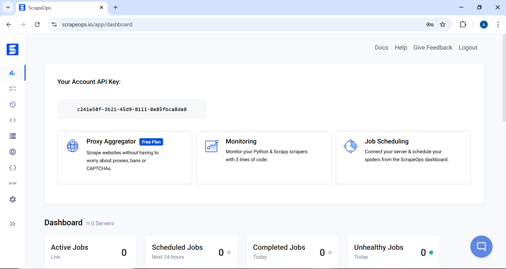

# ScrapeOps n8n Community Node

[](https://badge.fury.io/js/%40scrapeops%2Fn8n-nodes-scrapeops)
[](https://opensource.org/licenses/MIT)

The **[ScrapeOps n8n node](https://n8n.io/integrations/scrapeops/)** is a powerful integration that brings ScrapeOps' web scraping capabilities directly into your n8n workflows. This node allows you to leverage ScrapeOps' proxy aggregation, HTML parsing, and structured data extraction services without writing complex code.


## What is ScrapeOps?

[ScrapeOps](https://scrapeops.io) provides a suite of tools to simplify web scraping operations:

- **🔀 Proxy API**: Access high-quality proxies through a single endpoint for reliable web scraping
- **📊 Parser API**: Extract structured data from HTML content of popular websites
- **💾 Data API**: Retrieve and query data from ScrapeOps datasets

## ✨ Key Features

### 🔀 Proxy API
- Smart proxy rotation across multiple providers
- [JavaScript rendering support](https://scrapeops.io/docs/web-scraping-proxy-api-aggregator/advanced-functionality/headless-browser/) for dynamic sites
- [Anti-bot bypass capabilities](https://scrapeops.io/docs/web-scraping-proxy-api-aggregator/advanced-functionality/anti-bot-bypass/) (Cloudflare, DataDome, etc.)
- [Geo-targeting options](https://scrapeops.io/docs/web-scraping-proxy-api-aggregator/advanced-functionality/country-geotargeting/)
- [Mobile and residential proxy support](https://scrapeops.io/docs/web-scraping-proxy-api-aggregator/advanced-functionality/residential-proxies/)
- [Session management](https://scrapeops.io/docs/web-scraping-proxy-api-aggregator/advanced-functionality/sticky-sessions/) for multi-step scraping

### 📊 Parser API
- Extract structured data from popular websites without maintaining your own parsers
- **Supported Sites**: [Amazon](https://scrapeops.io/docs/parser-api/parsers/amazon-product-parser/), [eBay](https://scrapeops.io/docs/parser-api/parsers/ebay-product-parser/), [Walmart](https://scrapeops.io/docs/parser-api/parsers/walmart-product-parser/), [Indeed](https://scrapeops.io/docs/parser-api/parsers/indeed-product-parser/), [Redfin](https://scrapeops.io/docs/parser-api/parsers/redfin-product-parser/)
- **Page Types**: Product pages, search results, reviews, categories
- Returns clean, structured JSON data

### 💾 Data API
- Direct access to structured data endpoints
- **[Amazon Product API](https://scrapeops.io/docs/data-api/amazon-product-api/)**: Get product details by ASIN or URL
- **[Amazon Search API](https://scrapeops.io/docs/data-api/amazon-product-search-api/)**: Search products and get structured results
- No HTML scraping required - get data in a single request

---

## 📦 Installation

### Method 1: Install via n8n Cloud UI (Recommended)

If you're using n8n Cloud, you can easily install the ScrapeOps node directly from the UI:

1. **Sign in to n8n**, open the editor, and click **+** in the top right to open the Nodes panel


2. **Search for "ScrapeOps"** node using the search bar. Look for the version marked by a badge ☑. Then, select **install**.


3. The ScrapeOps node will be installed and appear in your node palette automatically.

### Method 2: Install via n8n Settings (Self-Hosted)

For self-hosted n8n instances:

1. Open your n8n instance
2. Navigate to **Settings** → **Community Nodes**
3. Click **Install a community node**
4. Enter the package name: `@scrapeops/n8n-nodes-scrapeops`
5. Click **Install**
6. Restart your n8n instance when prompted

### Method 3: Manual Installation (Self-Hosted)

```bash
# Navigate to your n8n installation directory
cd ~/.n8n

# Install the ScrapeOps node
npm install @scrapeops/n8n-nodes-scrapeops

# Restart n8n
n8n start
```

### Method 4: Docker Installation

For Docker users, add the node to your `docker-compose.yml`:

```yaml
version: '3.8'
services:
  n8n:
    image: n8nio/n8n
    environment:
      - N8N_COMMUNITY_NODES_ENABLED=true
      - NODE_FUNCTION_ALLOW_EXTERNAL=n8n-nodes-scrapeops
    volumes:
      - ~/.n8n:/home/node/.n8n
```

Then install the node:

```bash
docker exec -it <container_name> npm install @scrapeops/n8n-nodes-scrapeops
docker restart <container_name>
```

---

## 🔑 Authentication

### Getting Your ScrapeOps API Key

To use the ScrapeOps node, you'll need a **ScrapeOps API key** which you can get by signing up for a [free account here](https://scrapeops.io/app/register/proxy).

**Steps to get your API key:**

1. **Sign up for a free account** at [ScrapeOps](https://scrapeops.io/app/register/proxy)
2. **Verify your email address** (required to activate your API key)
3. **Visit your dashboard** at [ScrapeOps Dashboard](https://scrapeops.io/app/dashboard)
4. **Copy your API key** from the dashboard



> ⚠️ **Important:** You must confirm your email address to activate your API key. Check your inbox for a verification email from ScrapeOps.

### Configure Credentials in n8n

1. In n8n, go to **Credentials** → **Add Credential**.


2. Search for **"ScrapeOps API"** and enter your API key.


3. Save and test the credentials.

---

## 🎯 Quick Start

### Adding the Node to a Workflow

1. Create a new workflow in n8n.
2. Click Add to Workflow **"ScrapeOps"** node from the palette.


3. Select an API (Proxy, Parser, or Data) and configure parameters.


You can monitor your usage in the [ScrapeOps Dashboard](https://scrapeops.io/app/dashboard).

---

## 📚 API Documentation

### 🔀 Proxy API

Route GET/POST requests through proxies to scrape blocked sites.

**Basic Parameters:**
- **URL:** Target URL to scrape (required)
- **Method:** GET or POST (default: GET)  
- **Return Type:** Default (raw response) or JSON

**Advanced Options:**

| Option | Type | Description | Default | Example Values |
|--------|------|-------------|---------|----------------|
| **[Follow Redirects](https://scrapeops.io/docs/web-scraping-proxy-api-aggregator/advanced-functionality/follow-redirects/)** | Boolean | Follow HTTP redirects | true | `true`, `false` |
| **[Keep Headers](https://scrapeops.io/docs/web-scraping-proxy-api-aggregator/advanced-functionality/custom-headers/)** | Boolean | Use your custom headers | false | `true`, `false` |
| **[Initial Status Code](https://scrapeops.io/docs/web-scraping-proxy-api-aggregator/advanced-functionality/transparent-status-codes/)** | Boolean | Return initial status code | false | `true`, `false` |
| **[Final Status Code](https://scrapeops.io/docs/web-scraping-proxy-api-aggregator/advanced-functionality/transparent-status-codes/)** | Boolean | Return final status code | false | `true`, `false` |
| **[Optimize Request](https://scrapeops.io/docs/web-scraping-proxy-api-aggregator/advanced-functionality/optimize-request/)** | Boolean | Auto-optimize settings | false | `true`, `false` |
| **[Max Request Cost](https://scrapeops.io/docs/web-scraping-proxy-api-aggregator/advanced-functionality/optimize-request/)** | Number | Max credits to use (with optimize) | 0 | `10`, `50`, `100` |
| **[Render JavaScript](https://scrapeops.io/docs/web-scraping-proxy-api-aggregator/advanced-functionality/headless-browser/)** | Boolean | Enable headless browser | false | `true`, `false` |
| **[Wait Time](https://scrapeops.io/docs/web-scraping-proxy-api-aggregator/advanced-functionality/wait-time/)** | Number | Wait before capture (ms) | 0 | `3000`, `5000` |
| **[Wait For](https://scrapeops.io/docs/web-scraping-proxy-api-aggregator/advanced-functionality/wait-for/)** | String | CSS selector to wait for | - | `.product-title`, `#content` |
| **[Scroll](https://scrapeops.io/docs/web-scraping-proxy-api-aggregator/advanced-functionality/scroll-page/)** | Number | Scroll pixels before capture | 0 | `1000`, `2000` |
| **[Screenshot](https://scrapeops.io/docs/web-scraping-proxy-api-aggregator/advanced-functionality/screenshot/)** | Boolean | Return base64 screenshot | false | `true`, `false` |
| **[Device Type](https://scrapeops.io/docs/web-scraping-proxy-api-aggregator/advanced-functionality/device-type/)** | String | Device emulation | desktop | `desktop`, `mobile` |
| **[Premium Proxies](https://scrapeops.io/docs/web-scraping-proxy-api-aggregator/advanced-functionality/premium-proxies/)** | String | Premium level | level_1 | `level_1`, `level_2` |
| **[Residential Proxies](https://scrapeops.io/docs/web-scraping-proxy-api-aggregator/advanced-functionality/residential-proxies/)** | Boolean | Use residential IPs | false | `true`, `false` |
| **[Mobile Proxies](https://scrapeops.io/docs/web-scraping-proxy-api-aggregator/advanced-functionality/mobile-proxies/)** | Boolean | Use mobile IPs | false | `true`, `false` |
| **[Session Number](https://scrapeops.io/docs/web-scraping-proxy-api-aggregator/advanced-functionality/sticky-sessions/)** | Number | Sticky session ID | 0 | `12345`, `67890` |
| **[Country](https://scrapeops.io/docs/web-scraping-proxy-api-aggregator/advanced-functionality/country-geotargeting/)** | String | Geo-targeting country | - | `us`, `gb`, `de`, `fr`, `ca`, `au`, `jp`, `in` |
| **[Bypass](https://scrapeops.io/docs/web-scraping-proxy-api-aggregator/advanced-functionality/anti-bot-bypass/)** | String | Anti-bot bypass level | - | `cloudflare_level_1`, `cloudflare_level_2`, `cloudflare_level_3`, `datadome`, `perimeterx`, `incapsula`, `generic_level_1` to `generic_level_4` |

**Example Configuration:**
```
API Type: Proxy API
URL: https://example.com
Method: GET
Render JavaScript: true
Wait Time: 3000
Country: us
```

### 📊 Parser API

Parse HTML into structured JSON for supported domains.

**Parameters:**
- **Domain:** [Amazon](https://scrapeops.io/docs/parser-api/parsers/amazon-product-parser/), [eBay](https://scrapeops.io/docs/parser-api/parsers/ebay-product-parser/), [Walmart](https://scrapeops.io/docs/parser-api/parsers/walmart-product-parser/), [Indeed](https://scrapeops.io/docs/parser-api/parsers/indeed-product-parser/), [Redfin](https://scrapeops.io/docs/parser-api/parsers/redfin-product-parser/)
- **URL:** Page URL (required)
- **HTML Content:** Raw HTML to parse (required)

**Example Configuration:**
```
API Type: Parser API
Domain: Amazon
URL: https://www.amazon.com/dp/B08N5WRWNW
HTML Content: {{ $node["Proxy_API"].json.body }}
```

### 💾 Data API

Tap into pre-scraped datasets for commerce, jobs, and real estate without maintaining your own crawlers or parsers.

**Workflow basics**

- **Domain**: Choose `Amazon`, `eBay`, `Walmart`, `Indeed`, or `Redfin`.
- **API Type**: Select the dataset endpoint that matches the data you need (product, search, reviews, etc.).
- **Input Type**: Decide whether you want to identify the record via ID, query, or URL.
- **Advanced Options**: Provide localization parameters (`country`, `tld`) when available to scope the dataset to a specific market.

**1. Amazon Product Data (Using URL)**
```text
Domain: Amazon
API Type: Product API
Input Type: URL
Product URL: https://www.amazon.com/dp/B08N5WRWNW
```

**2. Walmart Search Results (Using Query)**
```text
Domain: Walmart
API Type: Search API
Input Type: Query
Search Query: laptop
Advanced Options: Country = us
```

**Supported Domains:**
- **Amazon**: Product, Search
- **eBay**: Product, Search, Feedback, Category, Store
- **Walmart**: Product, Search, Review, Shop, Browse, Category
- **Indeed**: Job Search, Job Detail, Company Search/Reviews/Jobs
- **Redfin**: Sale/Rent Search, Detail, Building, Agent, State


---

## 🎯 Common Use Cases

### 1. **Price Monitoring**
- Track product prices across multiple e-commerce sites
- Set up alerts for price drops
- Generate competitive pricing reports

### 2. **Market Research**
- Collect product reviews and ratings
- Monitor competitor inventory
- Track market trends

### 3. **Lead Generation**
- Extract business information from directories
- Collect job postings from career sites
- Find real estate listings

### 4. **Content Aggregation**
- Collect news articles
- Monitor social media mentions
- Aggregate product descriptions

---

## 🛠️ Best Practices

### 1. Start Simple
Begin with basic requests and add complexity:
```
1. Basic GET request
2. Add JavaScript rendering if needed
3. Add wait conditions
4. Enable anti-bot bypass if blocked
```

### 2. Optimize for Cost
- Use [`optimize_request: true`](https://scrapeops.io/docs/web-scraping-proxy-api-aggregator/advanced-functionality/optimize-request/) for automatic optimization
- Set `max_request_cost` to control spending
- Only enable features you need

### 3. Handle Dynamic Content
For JavaScript-heavy sites:
```
Render JavaScript: true
Wait Time: 3000
Wait For: .main-content
Scroll: 1000
```

### 4. Session Management
For multi-step scraping:
```
Session Number: 12345
// Use same number across requests
```

---

## 🐛 Troubleshooting

### Node Not Appearing
**Problem:** ScrapeOps node doesn't show up after installation

**Solution:**
1. Ensure n8n was restarted after installation
2. Check that community nodes are enabled
3. Verify the installation with: `npm list @scrapeops/n8n-nodes-scrapeops`

### Local Development Setup

1. **Install n8n globally**
   ```bash
   npm install n8n -g
   ```

2. **Navigate to your n8n data directory**
   ```bash
   cd ~/.n8n
   ```

3. **Create and enter a custom folder**
   ```bash
   mkdir -p custom
   cd custom
   ```

4. **Initialize the workspace**
   ```bash
   npm init -y
   ```

5. **Build & pack the node (run inside the `n8n-community-node` repo)**
   ```bash
   # Install dependencies (use npm install for local dev or npm ci for clean installs)
   npm install
   # npm ci

   # Build and create the tarball
   npm run build
   PKG=$(npm pack | tail -n1)
   ```

6. **Install the packed artifact into your custom folder that we created under .n8n**
   ```bash
   npm install --no-save "<PATH_TO_YOUR_REPO>/$PKG"
   ```

7. **Start n8n**
  ```bash
  n8n
  ```   

### Authentication Failures
**Problem:** "Invalid API Key" error

**Solution:**
1. Verify API key is copied correctly (no extra spaces)
2. Check if API key is active in ScrapeOps dashboard
3. Ensure you're using the correct credential in the node

### Connection Timeouts
**Problem:** Requests timing out

**Solution:**
1. Check your firewall settings
2. Verify n8n can make external HTTP requests
3. Test with a simple URL first (like httpbin.org)

---

## 📖 Resources

- **[ScrapeOps Documentation](https://scrapeops.io/docs/intro/)** - Complete API documentation
- **[ScrapeOps n8n Node Documentation](https://scrapeops.io/docs/n8n/overview)** - Complete ScrapeOps n8n Node documentation
- **[n8n Community Nodes Documentation](https://docs.n8n.io/integrations/community-nodes/)** - n8n integration guide
- **[ScrapeOps Dashboard](https://scrapeops.io/app/dashboard)** - Monitor usage and performance
- **[n8n Community Forum](https://community.n8n.io/)** - Get help from the community

---

## 🤝 Support

- **ScrapeOps Support:** support@scrapeops.io
- **n8n Community Forum:** [community.n8n.io](https://community.n8n.io)
- **GitHub Issues:** [Report bugs or request features](https://github.com/ScrapeOps/n8n-community-node/issues)

---

## 📄 License

[MIT](LICENSE.md)

---

**Ready to automate your web scraping?** Get started with the [ScrapeOps n8n integration](https://n8n.io/integrations/scrapeops/) today!
